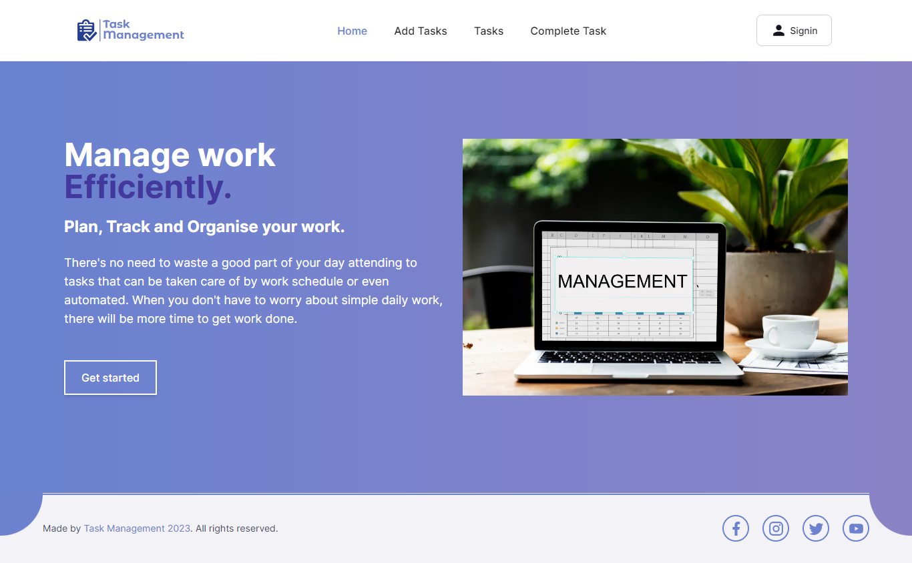

### Task Management Frontend

### Live Link:

```
https://task-management-client-tau.vercel.app/
```

### Introduction

Welcome to the Task Management Frontend! This web application serves as the user
interface for the Task Management platform, where users can keep their daily task and they can update and delete their task as well. To adding the task user should create a account first by their name, email, password and imageUrl(optional).

The primary objective of this frontend application is to provide users with a
seamless and enjoyable experience while exploring the task management. It interacts with the task management API to fetch and display task information, enabling users to search for task, view detailed, and manage their task effectively.

### Technologies

- Next.js(app router)
- TypeScript
- TailwindCSS
- React-Redux
- Redux-toolkit
- RTK Query
- React-hook-form


